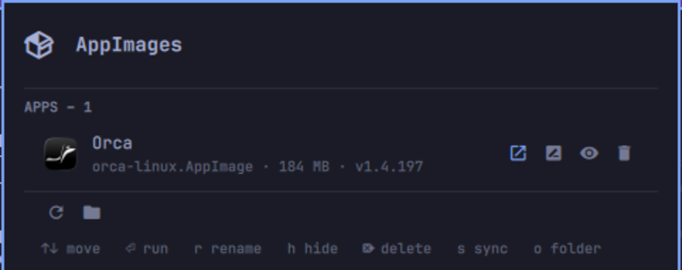

# AppImages

An Omarchy shell plugin that keeps a folder of AppImages and your application
launcher in step.

Drop an AppImage in `~/AppImage` and it shows up in the launcher a moment
later, under the name, icon, categories, mime types and window class the
AppImage ships with. Delete the file and the launcher entry goes with it.
Anything you rename stays renamed, including across a new version of the
AppImage.



## What it does

- **Watches the folder.** A headless service runs `inotifywait` on the
  AppImage folder, so entries appear and disappear as files do — no polling,
  no login script.
- **Reads the AppImage, not the filename.** Every AppImage carries its own
  desktop entry and icon. The plugin unpacks just those two paths — a couple
  of hundred milliseconds even on a 200MB image — and builds the launcher
  entry from them. Everything the launcher searches on comes along —
  `GenericName`, `Keywords` and their translations — along with
  `StartupWMClass`, so Hyprland matches the window to the app, the flags the
  AppImage's own `Exec` carried, and its right-click actions ("New Window").
- **Falls back gracefully.** An AppImage with no embedded metadata still gets
  an entry, named after its filename (`sound_studio.AppImage` → "Sound
  Studio") with a generic icon.
- **Renames without lying to you.** The launcher name is an override stored
  next to the plugin's config; the AppImage is never modified. Clear the
  override and the app's own name comes back.
- **Knows what is already open.** An AppImage with a window gets a focus
  button instead of a run button, matched on its window class, so you never
  start a second copy by accident.
- **Says so when a launch fails.** An AppImage that dies on the spot — missing
  FUSE, a broken image — would otherwise vanish silently. Running one from the
  panel reports the first line of its error instead.
- **Costs nothing when idle.** Results are cached against each file's size and
  mtime, so a sync that finds no changes does no work.

## Install

```bash
omarchy plugin add https://github.com/hpolthof/omarchy-appimages.git
omarchy plugin enable io.github.hpolthof.appimages --section right
```

The bar widget is enabled by the second command. The folder watcher is a
separate `service` kind, which Omarchy enables by plugin id — add it to the
`plugins` array in `~/.config/omarchy/shell.json`:

```json
{
  "plugins": [
    { "id": "io.github.hpolthof.appimages" }
  ]
}
```

### Dependencies

Everything here ships with Omarchy already; nothing extra is installed.

| Used for | Needs |
| --- | --- |
| Reading and writing the override file | `jq` |
| Watching the folder | `inotifywait` (`inotify-tools`) |
| Seeing which AppImages have a window open | `hyprctl` |
| Focusing an open window | `omarchy-hyprland-focus-app` |
| Detaching a launch from the shell | `setsid` (`util-linux`) |
| Reporting a launch that fails | `omarchy-notification-send` |
| Opening the folder | `xdg-open` (`xdg-utils`), `uwsm-app` |
| `bin/appimages rename` and `menu` from a terminal | `omarchy-menu-select`, `omarchy-menu-input` |

`update-desktop-database` (`desktop-file-utils`) is used when present and
skipped when it is not.

## Using it

Click the 󰏖 icon in the bar for the list. Each row shows the launcher name,
the filename, the size and the version the AppImage reports, and carries four
buttons: run it (or focus it, if a window is already open), rename it, hide it
from the launcher, or delete the file. The row itself does nothing on click, so
there is never a question of what will happen — but hovering it moves the
cursor there, so the mouse and the keyboard drive the same selection.

Hiding keeps the file and its icon and only stops the launcher offering it.
Deleting removes the AppImage from disk and always asks first.

Renaming happens in the row: the name turns into a text field, Enter commits,
Esc cancels. Submitting an empty field clears the override and restores the
AppImage's own name. Right-clicking the bar icon forces a sync.

Everything in the panel is reachable from the keyboard. The cursor runs past
the last row into the footer, so the two footer buttons are arrow-key targets
of their own:

| Key | Action |
| --- | --- |
| `↑` / `↓` | Move the cursor, rows then footer |
| `Enter` | Run the selected AppImage, or press the selected footer button |
| `r` | Rename the selected AppImage |
| `h` | Hide it from the launcher, or show it again |
| `Del` | Delete the file, after a confirmation |
| `s` | Sync now |
| `o` | Open the folder |
| `Esc` | Close the panel |

### Opening it with a key

A plugin cannot ship a Hyprland binding, so add one to
`~/.config/hypr/bindings.lua` yourself. `SUPER + A` is free on a stock Omarchy
(`SUPER SHIFT + A`, `SUPER CTRL + A` and `SUPER SHIFT ALT + A` are not):

```lua
o.bind("SUPER + A", "AppImages", "omarchy-shell -q io.github.hpolthof.appimages toggle")
```

Hyprland reloads on save; `hyprctl configerrors` confirms it took. The `-q`
makes the call a no-op instead of an error when the shell is not running.

## Removing it

```bash
omarchy plugin disable io.github.hpolthof.appimages
omarchy plugin remove io.github.hpolthof.appimages
```

Then drop the plugin id from the `plugins` array in
`~/.config/omarchy/shell.json`, and clear what it generated:

```bash
rm -f ~/.local/share/applications/appimage-*.desktop
rm -rf ~/.local/state/appimages
rm -f ~/.config/omarchy/appimages.json
update-desktop-database ~/.local/share/applications
```

Your AppImages are not touched — the plugin only ever writes the three paths
above, and only deletes an AppImage when you ask it to from the panel.

## Configuration

`~/.config/omarchy/appimages.json`, created on first use:

```json
{
  "directory": "~/AppImage",
  "apps": {
    "orca-linux": {
      "name": "Orca IDE",
      "args": "--no-sandbox",
      "categories": "Development;",
      "hidden": "true"
    }
  }
}
```

| Key | Effect |
| --- | --- |
| `directory` | Folder to watch. Defaults to `~/AppImage`. |
| `apps.<id>.name` | Launcher name. Absent means the AppImage's own name. |
| `apps.<id>.args` | Extra arguments appended to `Exec`, e.g. `--no-sandbox`. |
| `apps.<id>.categories` | Overrides the AppImage's `Categories`. |
| `apps.<id>.hidden` | `"true"` writes `NoDisplay=true`, hiding it from the launcher. The panel's eye button writes this. |

The id is the filename without its extension, with anything outside
`A-Za-z0-9._-` replaced by a dash: `My Cool App.AppImage` → `My-Cool-App`.
Case and separators are kept, so `Test-Tool.AppImage` and `test_tool.AppImage`
stay two different apps. Renaming the file changes the id, and an override
keyed to the old one is left behind.

## From the terminal or a keybinding

The service and the widget each answer over IPC:

```bash
omarchy-shell appimages sync                          # resync now
omarchy-shell appimages directory                     # the watched folder
omarchy-shell appimages status                        # "ok", or the last error
omarchy-shell io.github.hpolthof.appimages toggle     # show/hide the panel
omarchy-shell io.github.hpolthof.appimages rename orca-linux "Orca IDE"
omarchy-shell io.github.hpolthof.appimages run orca-linux      # run, or focus
omarchy-shell io.github.hpolthof.appimages toggleHidden orca-linux
omarchy-shell io.github.hpolthof.appimages remove orca-linux   # deletes the file
```

`bin/appimages` is a normal script and works on its own, including a menu-driven
rename that does not need the bar widget:

```bash
bin/appimages sync [--quiet]      # regenerate desktop entries
bin/appimages list                # one TSV row per AppImage
bin/appimages rename [id] [name]  # empty name resets to the embedded one
bin/appimages hide <id> [on|off]  # toggles without a second argument
bin/appimages run <id>            # detached, and reports a start that fails
bin/appimages focus <id>          # focus its window, if one is open
bin/appimages delete <id>         # deletes the AppImage file
bin/appimages menu                # pick sync / rename / open folder
```

### Omarchy menu entries

To reach it from the Omarchy menu instead, add this to
`~/.config/omarchy/extensions/omarchy-menu.jsonc`:

```jsonc
"setup.appimages": {"icon":"󰏖","label":"AppImages","aliases":["appimage"]},
"setup.appimages.panel": {"icon":"󰏖","label":"Show","action":"omarchy-shell -q io.github.hpolthof.appimages open"},
"setup.appimages.sync": {"icon":"󰑐","label":"Sync","action":"omarchy-shell -q appimages sync"},
"setup.appimages.rename": {"icon":"󰑕","label":"Rename","action":"~/.config/omarchy/plugins/io.github.hpolthof.appimages/bin/appimages rename"},
"setup.appimages.folder": {"icon":"󰉋","label":"Open folder","action":"uwsm-app -- xdg-open ~/AppImage"},
```

## What it writes

| Path | Contents |
| --- | --- |
| `~/.local/share/applications/appimage-*.desktop` | The launcher entries. Each carries `X-AppImage-File`, which is how the plugin recognises its own and cleans them up. |
| `~/.local/state/appimages/<id>/` | Cached icon, embedded desktop entry, and the size+mtime fingerprint that lets a no-op sync stay a no-op. |
| `~/.config/omarchy/appimages.json` | Your overrides. |

Nothing else on the system is touched, and no AppImage is ever modified.

## License

MIT — see [LICENSE](LICENSE).
